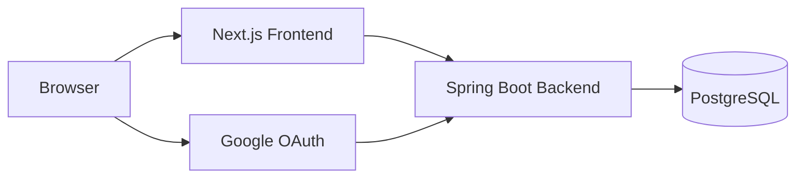

# CareerDock

CareerDock은 취업 준비 과정에서 흩어지는 지원 현황, 자소서, 자격증, 파일, 외부 링크, 일정을 한곳에서 관리하는 웹 애플리케이션입니다.

지원 건별로 마감일과 전형 상태를 관리하고, 제출에 사용한 자소서 버전과 자료를 나중에 다시 확인할 수 있도록 만드는 것이 핵심 목표입니다.

## 주요 기능

- Google OAuth 로그인: Spring Security OAuth2 Login과 서버 세션 기반 인증
- 대시보드: `GET /api/dashboard/summary` 한 번으로 이번 주 마감, 작성 중 지원서, 다가오는 일정, 임박 마감 조회
- 지원관리: 지원 건 목록, 상세, 등록, 수정, 상태 변경, 삭제
- 자소서: 지원 건별 문항, 답변, 버전 생성, 제출본 잠금, 경험 태그
- 내 자료: 자격증/어학, 외부 링크, 파일 업로드/다운로드, 자격번호 마스킹 및 전체 번호 조회
- 캘린더: CareerDock 내부 일정 월간 조회, 다가오는 일정, 등록, 수정, 삭제, 지원 건 연결
- Google Calendar 연동: 로그인과 분리된 추가 동의, 연결 상태 조회, 재동기화, 연결 해제, CareerDock 전용 캘린더 이벤트 생성/수정/삭제
- Docker Compose: PostgreSQL, Spring Boot Backend, Next.js Frontend 통합 실행
- 테스트: Spring Boot 테스트, Vitest/Testing Library 기반 프론트 핵심 테스트

Google Calendar 권한은 로그인 시 자동 요청하지 않고, 사용자가 설정 화면에서 연결할 때만 별도 동의를 요청합니다.

## 기술 스택

| 영역 | 기술 |
|---|---|
| Frontend | Next.js App Router, React, TypeScript, Tailwind CSS |
| Backend | Java 21, Spring Boot, Spring Security, Spring Data JPA |
| Database | PostgreSQL, Flyway |
| Auth | Google OAuth2 Login, Spring Session, HttpOnly `JSESSIONID` Cookie |
| Test | JUnit 5, Spring Security Test, Testcontainers, Vitest, Testing Library |
| Infra | Docker Compose, multi-stage Docker build |

## 프로젝트 구조

```text
.
├── src/                         # Next.js frontend
│   ├── app/                     # App Router routes
│   ├── components/              # UI/layout components
│   ├── features/                # auth, dashboard, applications, essays, materials, calendar
│   └── lib/api/                 # shared API client, endpoints, env
├── backend/                     # Spring Boot backend
│   ├── src/main/java/com/careerdock/
│   ├── src/main/resources/db/migration/
│   └── src/test/
├── docs/
│   ├── api-spec.md              # 실제 API 계약
│   ├── architecture.md          # 시스템 구조
│   ├── portfolio.md             # 포트폴리오 설명 자료
│   └── 제안서.md                # 프로젝트 제안서
├── docker-compose.yml           # postgres + backend + frontend
├── Dockerfile                   # frontend production image
└── backend/Dockerfile           # backend production image
```

## API 문서

API 계약은 [docs/api-spec.md](docs/api-spec.md)를 기준으로 확인합니다.

관련 문서:

- [docs/architecture.md](docs/architecture.md)
- [docs/portfolio.md](docs/portfolio.md)
- [docs/제안서.md](docs/%EC%A0%9C%EC%95%88%EC%84%9C.md)

## Architecture



브라우저는 Next.js 화면을 사용하고, API 요청은 Spring Boot로 전달됩니다. 인증은 Google OAuth 완료 후 서버 세션과 HttpOnly Cookie로 유지됩니다.

## 로컬 실행

PostgreSQL만 Docker로 띄우고 backend/frontend를 로컬 프로세스로 실행하는 방식입니다.

```bash
cd backend
docker compose up -d postgres
./gradlew bootRun --args='--spring.profiles.active=local'
```

다른 터미널에서:

```bash
npm install
npm run dev
```

접속:

```text
http://localhost:3000
```

Backend health:

```bash
curl http://localhost:8080/api/health
```

## 환경변수

실제 Secret은 커밋하지 않습니다. 로컬 실행은 `.env.local`, `backend/.env`, Docker Compose는 root `.env`를 사용합니다.

Frontend 예시:

```bash
NEXT_PUBLIC_API_BASE_URL=http://localhost:8080
NEXT_PUBLIC_GOOGLE_OAUTH_START_PATH=/oauth2/authorization/google
```

Backend 예시:

```bash
SERVER_PORT=8080
FRONTEND_URL=http://localhost:3000
ALLOWED_ORIGINS=http://localhost:3000
GOOGLE_CLIENT_ID=replace-with-google-client-id
GOOGLE_CLIENT_SECRET=replace-with-google-client-secret
GOOGLE_REDIRECT_URI=http://localhost:8080/login/oauth2/code/google
GOOGLE_CALENDAR_REDIRECT_URI=http://localhost:8080/api/calendar/oauth/callback
CREDENTIAL_ENCRYPTION_KEY=replace-with-base64-32-byte-key
```

Docker Compose용 전체 placeholder는 [.env.example](.env.example)을 참고합니다.

## Google OAuth 설정

Google Cloud Console의 OAuth Client에 아래 Redirect URI를 모두 등록합니다.

```text
http://localhost:8080/login/oauth2/code/google
http://localhost:8080/api/calendar/oauth/callback
```

현재 로그인 방식:

- OAuth 시작 URL: `http://localhost:8080/oauth2/authorization/google`
- Callback URL: `http://localhost:8080/login/oauth2/code/google`
- Google Calendar 권한 동의 Callback URL: `http://localhost:8080/api/calendar/oauth/callback`
- 인증 유지: Spring Session + HttpOnly `JSESSIONID`
- 프론트 요청: `credentials: "include"`
- 프론트는 Google token, authorization code, client secret을 저장하지 않습니다.

## Docker 실행

root `docker-compose.yml`은 PostgreSQL, Spring Boot, Next.js를 함께 실행합니다.

```bash
cp .env.example .env
```

`.env`에 로컬 Secret을 채운 뒤:

```bash
docker compose config
docker compose build
docker compose up -d
docker compose ps
```

접속:

```text
Frontend: http://localhost:3000
Backend:  http://localhost:8080
```

종료:

```bash
docker compose down
```

`docker compose down`은 named volume을 유지합니다. 로컬 DB와 업로드 파일을 지우려는 경우가 아니면 `-v`를 사용하지 않습니다.

## 테스트

Frontend:

```bash
npm run typecheck
npm run lint
npm test
npm run build
```

통합 확인:

```bash
npm run verify
```

Backend:

```bash
cd backend
./gradlew test
./gradlew build
```

Backend 테스트는 Testcontainers PostgreSQL을 사용하므로 Docker 실행 환경이 필요합니다.

## 배포

현재 배포 기준 구성은 Docker Compose입니다.

- PostgreSQL은 named volume으로 데이터 유지
- Backend는 Java 21 runtime image에서 Spring Boot jar 실행
- Frontend는 Next.js standalone output으로 production server 실행
- 운영 환경에서는 Secret을 `.env` 파일 대신 배포 환경의 Secret 관리 방식으로 주입하는 것을 권장
- 프론트와 백엔드가 다른 도메인일 경우 `ALLOWED_ORIGINS`, `COOKIE_SECURE`, `COOKIE_SAME_SITE`를 HTTPS 기준으로 설정
- Google OAuth Redirect URI는 운영 도메인 기준으로 추가 등록 필요

## 보안 주의

- Client ID, Client Secret, DB Password, Encryption Key를 문서나 Git에 남기지 않습니다.
- 자격번호는 기본 마스킹하고, 전체 번호 조회는 명시적 사용자 액션으로만 수행합니다.
- 사용자 데이터는 서버 세션의 내부 사용자 ID 기준으로 조회하며, API request로 `userId`를 받지 않습니다.
- 다른 사용자 리소스 접근은 존재 여부를 숨기기 위해 `404 NOT_FOUND`로 처리합니다.
