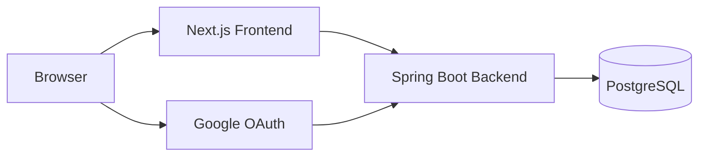
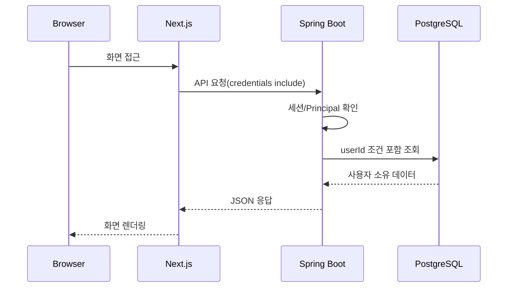
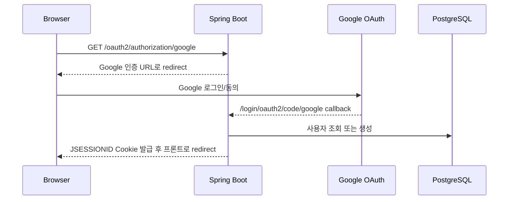
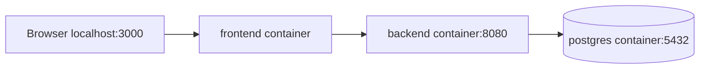

# CareerDock Architecture

이 문서는 현재 저장소 기준의 실행 구조를 설명한다. 구현되지 않은 배포 요소나 외부 연동은 별도로 표시한다.

## Overview



## Runtime 구성

| 구성 | 역할 | 로컬 기본 포트 |
|---|---|---:|
| Browser | 사용자 화면 접근, Google OAuth redirect 수행 | - |
| Next.js Frontend | App Router 화면, API client, 서버/클라이언트 렌더링 | 3000 |
| Spring Boot Backend | REST API, 인증, 파일 처리, 도메인 로직 | 8080 |
| PostgreSQL | 영속 데이터 저장 | 5432 |
| Google OAuth | 로그인 인증 제공자 | - |

## 요청 흐름

### 일반 API



### Google OAuth 로그인



## Frontend 구조

```text
src/
├── app/                 # Next.js routes
├── components/          # UI/layout 공통 컴포넌트
├── features/
│   ├── auth/
│   ├── dashboard/
│   ├── applications/
│   ├── essays/
│   ├── materials/
│   └── calendar/
└── lib/api/             # API client, endpoints, env
```

원칙:

- API URL은 `src/lib/api/endpoints.ts`와 feature API 모듈에서 관리한다.
- 컴포넌트가 backend DTO를 그대로 다루지 않도록 mapper/service 계층을 둔다.
- API 요청은 공통 client를 사용하고 `credentials: "include"`를 적용한다.
- Loading, Error, Empty 상태를 화면에서 구분한다.

## Backend 구조

```text
backend/src/main/java/com/careerdock/
├── auth/                # OAuth 사용자 서비스, Auth API
├── application/         # 지원 건
├── essay/               # 자소서 문항/답변/버전
├── credential/          # 자격증/어학
├── file/                # 파일 메타데이터/저장소
├── link/                # 외부 링크
├── calendar/            # 내부 캘린더 및 Google Calendar 관련 API
├── dashboard/           # Summary API
├── global/              # security, config, exception
└── health/              # /api/health
```

원칙:

- 사용자 데이터는 인증 principal에서 얻은 내부 사용자 ID 기준으로 격리한다.
- 다른 사용자 리소스 접근은 `404 NOT_FOUND`로 처리한다.
- Flyway migration으로 DB 스키마를 관리한다.
- 공통 오류 응답은 `ErrorResponse` 구조를 사용한다.

## Docker Compose 구조



서비스:

- `postgres`: PostgreSQL 16, `backend_careerdock-postgres-data` volume
- `backend`: Spring Boot jar, `backend-files` volume
- `frontend`: Next.js standalone production server

컨테이너 내부에서는 `localhost`가 아니라 Compose service name을 사용한다.

- backend -> `postgres:5432`
- frontend server -> `backend:8080`
- browser -> `localhost:3000`, `localhost:8080`

## Security

- 인증 방식: Spring Security Session + HttpOnly Cookie
- OAuth state 검증: Spring Security OAuth2 Client
- CORS: `ALLOWED_ORIGINS` 기반 허용, credentials 허용
- Cookie: local은 `SameSite=Lax`, 운영 cross-site 환경은 HTTPS와 `SameSite=None`, `Secure=true` 필요
- Secret: Git과 문서에 실제 값 저장 금지

## 데이터 저장

- PostgreSQL: 사용자, 지원 건, 회사, 자소서, 자료, 일정 등 영속 데이터
- Backend file volume: 업로드 파일 본문 저장
- Flyway: DB migration 관리

## 현재 한계

- 운영 배포용 reverse proxy, HTTPS, CI/CD는 문서상 준비 항목이며 현재 Compose에는 포함하지 않았다.
- Google Calendar 외부 동기화는 설정 화면에서 사용자가 별도로 연결한 뒤 CareerDock 전용 캘린더에만 반영한다.
- OpenAPI/Swagger 자동 생성 문서는 아직 없다.
