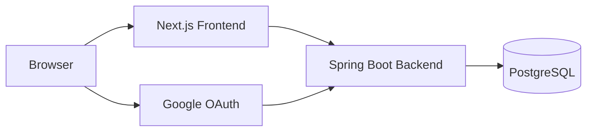

# CareerDock 제안서

## 1. 프로젝트명

CareerDock

취업 준비 과정에서 필요한 지원 현황, 자소서, 자료, 일정 정보를 한곳에서 관리하는 웹 애플리케이션입니다.

## 2. 문제 정의

취업 준비자는 여러 회사에 동시에 지원하면서 다음 정보를 반복해서 찾고 갱신해야 합니다.

- 회사별 지원 마감일
- 현재 전형 단계
- 제출한 자소서 문항과 답변
- 제출 당시 사용한 자소서 버전
- 자격증 번호, 어학 점수, 증빙 파일
- 포트폴리오, GitHub, Notion 같은 외부 링크
- 코딩테스트, 면접, 결과 발표 일정

이 정보가 메신저, 로컬 폴더, 메모 앱, 캘린더, 채용 사이트에 흩어져 있으면 마감 누락과 제출 자료 혼선이 생깁니다.

## 3. 타깃 사용자

- 여러 기업에 동시에 지원하는 취업 준비생
- 자소서 문항과 답변을 재사용하거나 버전별로 관리해야 하는 지원자
- 자격증, 포트폴리오, 증빙 파일을 자주 제출하는 지원자
- 지원 일정과 마감을 한 화면에서 확인하고 싶은 사용자

## 4. 핵심 기능

현재 저장소 기준으로 구현된 핵심 기능은 다음과 같습니다.

- Google OAuth 기반 로그인
- 지원 건 CRUD와 상태 관리
- 대시보드 Summary API와 실제 대시보드 연동
- 자소서 문항, 답변, 버전, 제출본 잠금
- 자격증/어학 자료 관리와 자격번호 마스킹
- 외부 링크 관리
- 파일 업로드, 다운로드, 삭제
- CareerDock 내부 캘린더 일정 조회, 등록, 수정, 삭제
- 지원 건과 자료/일정 연결
- PostgreSQL, Spring Boot, Next.js Docker Compose 실행

## 5. 기존 문제점

일반적인 취업 준비 방식에서는 다음 문제가 반복됩니다.

- 지원 마감과 일정이 캘린더와 메모에 분산된다.
- 어느 회사에 어떤 자소서 버전을 제출했는지 나중에 확인하기 어렵다.
- 자격증 번호와 증빙 파일을 매번 다시 찾는다.
- 지원 건별 제출 자료가 연결되어 있지 않아 최종 제출 전 검토가 어렵다.
- 대시보드 화면에서 필요한 정보를 여러 API로 나누어 조회하면 초기 화면이 느려지고 계약이 복잡해진다.

## 6. CareerDock 해결 방식

CareerDock은 `Application`을 중심으로 정보를 연결합니다.

- 지원 건에 회사, 직무, 마감일, 전형 상태를 저장한다.
- 자소서 답변은 버전으로 관리하고 제출본은 잠금 처리한다.
- 자격증, 파일, 외부 링크는 사용자 자료로 관리한 뒤 지원 건에 연결한다.
- 내부 캘린더 일정은 지원 건과 연결할 수 있다.
- 대시보드는 `GET /api/dashboard/summary` 하나로 첫 화면에 필요한 요약 데이터를 가져온다.
- API는 request parameter로 `userId`를 받지 않고, 인증 principal의 내부 사용자 ID로 데이터를 필터링한다.

## 7. 사용자 시나리오

1. 사용자는 Google 계정으로 로그인한다.
2. 자격증 또는 어학 성적을 등록하고, 자격번호는 기본적으로 마스킹된 상태로 관리한다.
3. 포트폴리오 파일과 GitHub/Notion 링크를 등록한다.
4. 지원할 회사와 직무를 지원 건으로 등록하고 마감일을 입력한다.
5. 지원 건에 자소서 문항을 추가하고 답변을 작성한다.
6. 제출한 답변은 버전으로 남기고 제출본 잠금 상태로 보존한다.
7. 코딩테스트나 면접 일정을 내부 캘린더에 등록한다.
8. 대시보드에서 이번 주 마감, 작성 중 지원서, 다가오는 일정, 임박 마감을 확인한다.

## 8. 기술 스택

| 영역 | 기술 |
|---|---|
| Frontend | Next.js App Router, React, TypeScript, Tailwind CSS |
| Backend | Java 21, Spring Boot, Spring Security, Spring Data JPA |
| Database | PostgreSQL, Flyway |
| Authentication | Google OAuth2 Login, Spring Session, HttpOnly Cookie |
| Test | JUnit 5, Spring Security Test, Testcontainers, Vitest, Testing Library |
| Runtime | Docker Compose, multi-stage Docker build |

## 9. 시스템 아키텍처

구성 요소:

- Browser: 사용자가 CareerDock 화면을 조작한다.
- Next.js: 화면 렌더링, API client, 라우팅, loading/error/empty 상태를 담당한다.
- Spring Boot: 인증, 도메인 API, 파일 처리, 사용자 데이터 격리를 담당한다.
- PostgreSQL: 지원 건, 자료, 자소서, 일정, 사용자 정보를 저장한다.
- Google OAuth: 로그인 인증을 담당한다.

## 10. 보안

- Spring Security Session과 HttpOnly `JSESSIONID` Cookie로 인증 상태를 유지한다.
- 프론트는 Google token, authorization code, client secret을 저장하지 않는다.
- API는 `userId`를 입력받지 않고 인증 principal에서 내부 사용자 ID를 얻는다.
- 다른 사용자 리소스 접근은 `404 NOT_FOUND`로 처리해 존재 여부를 노출하지 않는다.
- 자격번호는 기본 마스킹하고 전체 번호는 별도 조회 API로만 확인한다.
- 파일 다운로드는 공개 정적 경로가 아니라 인증된 API를 거친다.
- Secret 값은 `.env.example`에도 실제 값 대신 placeholder만 둔다.

## 11. 테스트

현재 테스트 범위:

- Backend: Controller, Service, OAuth 사용자 생성/재로그인, 인증 route, Dashboard Summary, Calendar, Materials 관련 테스트
- DB: Testcontainers PostgreSQL 기반 통합 테스트
- Frontend: API error 분기, GoogleLoginButton, Dashboard Summary, Materials Service, Calendar Service 중심의 Vitest 테스트
- 빌드 검증: `./gradlew test`, `./gradlew build`, `npm run typecheck`, `npm run lint`, `npm run build`

## 12. 배포 구조

현재 배포 준비 구조는 Docker Compose입니다.

- `postgres`: PostgreSQL 16, named volume으로 데이터 유지
- `backend`: Java 21 runtime image에서 Spring Boot jar 실행
- `frontend`: Next.js standalone output으로 production server 실행
- 내부 통신: frontend server는 `backend:8080`, backend는 `postgres:5432` 사용
- 외부 접속: 브라우저는 `localhost:3000`, API는 `localhost:8080`
- healthcheck: DB `pg_isready`, backend `/api/health`, frontend `/login`

운영 배포 시에는 HTTPS, 실제 도메인, Secret 관리, reverse proxy 구성이 추가로 필요합니다.

## 13. 향후 확장

구현 완료로 작성하지 않는 확장 후보입니다.

- Google Calendar 상세 오류 복구 UX 고도화
- 알림 및 리마인더 발송
- 제출 파일 버전 잠금 강화
- 지원 공고 URL 파싱
- OCR 기반 증빙 자료 자동 인식
- 자소서 검색/필터 고도화
- 배포 환경에서 Nginx, HTTPS, CI/CD 구성
